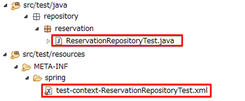
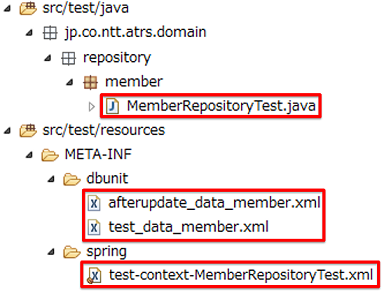
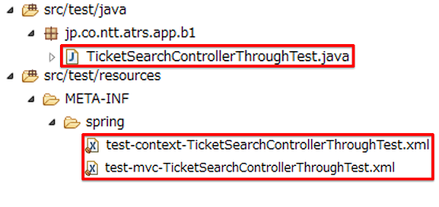

★：要検討

.. _ImplementOfUnitTest:

単体テストの実装
================================================================================

.. only:: html

 .. contents:: 目次
    :local:

Overview
--------------------------------------------------------------------------------

本節では、Spring Frameworkの機能を使用したコンポーネントに着目して、その単体テストの実装例を示す。

最初に、単体テストの実装で使用するOSSライブラリ構成を提示する。
次に、単体テストを実行するために共通して必要となるテストデータのセットアップ方法について説明し、
最後に、各レイヤー毎のテスト実装例を説明する。

なお、OSSライブラリ構成および実装例として記載しているサンプルは一例である。
実際に採用される際には、業務要件に従って検討していただきたい。

|

単体テスト対象のクラス、テスト方法及びそのテスト方法の詳細の一覧を以下に示す。

.. tabularcolumns:: |p{0.20\linewidth}|p{0.20\linewidth}|p{0.60\linewidth}|
.. list-table::
    :header-rows: 1
    :widths: 20 20 25 35

    * - レイヤー
      - テスト対象
      - テスト方法
      - 詳細
    * - インフラストラクチャ層
      - Repository
      - Junit + spring-test
      - データアクセスにSpring JDBCを使用する場合
    * - 
      - 
      - Junit + spring-test + DBUnit + spring-test-dbunit
      - データアクセスにDBUnitを使用する場合
    * - ドメイン層
      - Service + 依存クラス
      - Junit + spring-test
      - Serviceが依存するクラスを使用できる場合 トランザクション境界を確認する
    * - 
      - Service
      - Junit + Mockito
      - Serviceが依存するクラスをモック化する場合
    * - アプリケーション層
      - Controller + 依存クラス
      - Junit + spring-test + MockMVC
      - Controllerが依存するクラスを使用できる場合
    * - 
      - Controller
      - JUnit + MockMVC + Mockito
      - Controllerが依存するクラスをモック化する場合
    * - 
      - Helper
      - Junit + spring-test (+ DBUnit)
      - Helperが依存するクラスを使用できる場合
    * - 
      - Validation
      - JUnit
      - Bean Validationを使用する場合
    * - 
      - 
      - JUnit
      - Spring Validationを使用する場合

|

利用するOSSライブラリ
--------------------------------------------------------------------------------

OSSのバージョン★
^^^^^^^^^^^^^^^^^^^^^^^^^^^^^^^^^^^^^^^^^^^^^^^^^^^^^^^^^^^^^^^^^^^^^^^^^^^^^^^^

単体テストで利用するOSS一覧を以下に示す。
なお、本章では全ての機能を網羅しているわけではないため、使用するOSSはあくまで1例である。
また、サンプルを動作させるために利用するOSS一覧については、\ :ref:`frameworkstack_using_oss_version`\ を参照されたい。

.. tabularcolumns:: |p{0.15\linewidth}|p{0.27\linewidth}|p{0.25\linewidth}|p{0.15\linewidth}|p{0.13\linewidth}|
.. list-table::
    :header-rows: 1
    :widths: 15 27 25 15 13

    * - Type
      - GroupId
      - ArtifactId
      - Version
      - Spring IO platform
    * - Spring
      - org.springframework
      - spring-test
      - 4.3.5.RELEASE
      - \*
    * - Mockito
      - org.mockito
      - mockito-core
      - 1.10.19
      - \*
    * - JUnit
      - junit
      - junit
      - 4.12
      - \*
    * - SpringDBUnit
      - com.github.springtestdbunit
      - spring-test-dbunit
      - 1.3.0
      - \
    * - DBUnit
      - org.dbunit
      - dbunit
      - 2.5.4
      - \

|

ライブラリの設定
^^^^^^^^^^^^^^^^^^^^^^^^^^^^^^^^^^^^^^^^^^^^^^^^^^^^^^^^^^^^^^^^^^^^^^^^^^^^^^^^

単体テスト用のライブラリを\ ``pom.xml``\ の\ ``dependency``\ に追加を行う。以下に追加するライブラリを示す。

* ``pom.xml``

.. code-block:: xml

    <!-- == Begin Unit Test == -->
    <!-- (X) -->
    <dependency>
      <groupId>junit</groupId>
      <artifactId>junit</artifactId>
    </dependency>
    <!-- (X) -->
    <dependency>
      <groupId>org.springframework</groupId>
      <artifactId>spring-test</artifactId>
    </dependency>
    <!-- (X) -->
    <dependency>
      <groupId>org.DBUnit</groupId>
      <artifactId>DBUnit</artifactId>
      <version>2.X.X</version>
      <scope>test</scope>
    </dependency>
    <!-- (X) -->
    <dependency>
      <groupId>org.mockito</groupId>
      <artifactId>mockito-core</artifactId>
      <version>X.X.X</version>
      ★現行ATRS（terasoluna-gfw-parent 5.2.0.RELEASE）の場合、1.10.19
      <scope>test</scope>
    </dependency>
    <!-- (X) -->
    <dependency>
      <groupId>com.github.springtestDbUnit</groupId>
      <artifactId>spring-test-dbunit</artifactId>
      <version>1.3.0</version>
      <scope>test</scope>
    </dependency>
    <!-- == End Unit Test == -->

|

.. _SetUpOfTestingData:

テストデータのセットアップ
--------------------------------------------------------------------------------

ここではテストを実装する前段階として、テストデータについて説明する。
本章では、テストクラス実行時にテストデータをデータベース上に用意することを前提として、テスト用テーブルの作成方法および
テストデータの初期化方法について説明する。

.. _CreateTableforTest:

テスト用テーブルの作成方法
^^^^^^^^^^^^^^^^^^^^^^^^^^^^^^^^^^^^^^^^^^^^^^^^^^^^^^^^^^^^^^^^^^^^^^^^^^^^^^^^

テストを実施するにあたり、データストアにデータベースを使用する場合、テスト用のデータベースのセットアップが必要になる。

テストで使用するテーブルを初期化する場合は、テスト用に作成したコンテキストに\ ``<jdbc:initialize-database>``\ を
定義することでテスト実行時にデータベースを初期化するためのSQL(DDLとDML)を発行することができる。
なお、\ ``<jdbc:initialize-database>``\ を使用して作成したテーブルと初期化データは実行後にコミットされるため、
テスト終了後もデータベースの状態は戻らないことに注意されたい。

設定例を以下に示す。

* ``test-context.xml``

.. code-block:: xml

  <!-- (1) -->
  <bean id="realDataSource" class="org.apache.commons.dbcp2.BasicDataSource" destroy-method="close">
    <property name="driverClassName" value="${database.driverClassName}" />
    <property name="url" value="${database.url}" />
    <property name="username" value="${database.username}" />
    <property name="password" value="${database.password}" />
    <property name="defaultAutoCommit" value="false" />
    <property name="maxTotal" value="${cp.maxActive}" />
    <property name="maxIdle" value="${cp.maxIdle}" />
    <property name="minIdle" value="${cp.minIdle}" />
    <property name="maxWaitMillis" value="${cp.maxWait}" />
  </bean>

  <!-- (2) -->
  <jdbc:initialize-database data-source="dataSource">
    <jdbc:script location="classpath*:/META-INF/sql/test-schema.sql" />
  </jdbc:initialize-database>

  <!-- omitted -->

.. tabularcolumns:: |p{0.10\linewidth}|p{0.90\linewidth}|
.. list-table::
    :header-rows: 1
    :widths: 10 90

    * - 項番
      - 説明
    * - | (1)
      - | データソースの実装クラスを指定する。
          例では、Apache Commons DBCPから提供されているデータソースクラス
          (\ ``org.apache.commons.dbcp2.BasicDataSource``\ )を指定する。
    * - | (2)
      - | 実行するSQLスクリプトの場所をscriptタグの\ ``location``\ 、SQLスクリプトファイルの文字コードを\ ``encoding``\ 
          に指定する。テスト共通データがある場合、テスト共通データ挿入用のDML文を指定することも可能である。

* ``RouteRepositoryTest.java``

.. code-block:: java

    @RunWith(SpringJUnit4ClassRunner.class) // (1)
    @ContextConfiguration(locations = {
            "classpath:META-INF/spring/test-context.xml" }) // (2)
    @Transactional
    public class RouteRepositoryTest {
        // omitted
    }

.. tabularcolumns:: |p{0.10\linewidth}|p{0.90\linewidth}|
.. list-table::
    :header-rows: 1
    :widths: 10 90

    * - 項番
      - 説明
    * - | (1)
      - | \ ``@RunWith``\ に\ ``SpringJUnit4ClassRunner``\ を指定することによって、Spring固有のアノテーションを
          テストクラスで利用できる。
    * - | (2)
      - | \ ``@ContextConfiguration``\ アノテーションにテスト用の設定ファイルを指定することによって、テストを行う際は
          テスト用の設定ファイルを読み込むようにできる。classpathを指定することによって、resource直下を参照できる。

.. warning::

   \ ``<jdbc:initialize-database>``\ タグに設定するSQLスクリプトには、明示的に「COMMIT;」を記述すること。

テスト用データの追加方法
^^^^^^^^^^^^^^^^^^^^^^^^^^^^^^^^^^^^^^^^^^^^^^^^^^^^^^^^^^^^^^^^^^^^^^^^^^^^^^^^

テスト実行時にテストデータが必要な場合、クラスレベルまたはメソッドレベルで、\ ``@Sql``\ アノテーションを使用することで
テスト実行前にテストデータを追加・更新することができる。
なお、\ ``@Before``\ アノテーションを使用して、テスト実行前にテストデータを追加・更新する方法もあるが、ここでは
\ ``@Sql``\ アノテーションを使用した方法を説明する。

設定例を以下に示す。

* ``RouteRepositoryTest.java``

.. code-block:: java

    @Test
    @Sql("classpath:META-INF/sql/route-dataset.sql") // (1)
    public void testFindAll() {
        // omitted
    }

.. tabularcolumns:: |p{0.10\linewidth}|p{0.90\linewidth}|
.. list-table::
    :header-rows: 1
    :widths: 10 90

    * - 項番
      - 説明
    * - | (1)
      - | \ ``@Sql``\ アノテーションをメソッドレベルで指定することによって、対象のテストメソッド実行前に
          \ ``@Sql``\ の引数に指定したSQLファイルが実行され、テストデータの追加・更新ができる。
        | なお、 \ ``@Sql``\ アノテーションをクラスレベルで指定した場合は、\ ``@Sql``\ アノテーションの指定のない
          テストメソッドすべてに対して適用される。

.. note:: **シーケンスの初期化方法**

    シーケンスは、トランザクションをロールバックしても進んだ値は戻らないという特徴を持つ。
    そのため、DBUnitでシーケンスから採番したカラムを持つレコードを検証する場合、シーケンスから採番したカラムは
    検証対象外とするか、以下のように明示的にシーケンスの初期化を行うSQLを実行し、テストの実施前に初期化する必要がある。

    * \ ``initialSequence.sql``\ （PostgreSQLの例）
    
     .. code-block:: sql
     
        ALTER SEQUENCE SQ_MEMBER_1 RESTART WITH 1;

    * シーケンスの初期化

     .. code-block:: java

        @Inject
        private JdbcTemplate jdbcTemplate;

        @Test
        @Sql("classpath:META-INF/sql/initialSequence.sql")
        public void testUpdate() throws Exception {

            // シーケンスに依存した処理の呼び出し
        }

    * テストクラス内の全テストメソッドでシーケンスの初期化が必要な場合の共通化（PostgreSQLの例）

    テストクラス内の全テストメソッドでシーケンスの初期化が必要な場合、 クラスレベルに\ ``@Sql``\ を付与すると、
    \ ``@Sql``\ を付与していない各メソッドに対してシーケンスの初期化処理を呼び出すことができ、共通化できる。

     .. code-block:: java

        @Sql("classpath:META-INF/sql/initialSequence.sql")
        public class TicketReserveServiceImplTestInject {

            @Test
            public void testUpdate1() throws Exception {

                // シーケンスに依存した処理の呼び出し
            }
        }

|

インフラストラクチャ層の単体テスト
--------------------------------------------------------------------------------

インフラストラクチャ層のテスト全体観点
^^^^^^^^^^^^^^^^^^^^^^^^^^^^^^^^^^^^^^^^^^^^^^^^^^^^^^^^^^^^^^^^^^^^^^^^^^^^^^^^

ここでは、インフラストラクチャ層の単体テストについて説明する。
インフラストラクチャ層の詳細については、開発ガイドラインの\ :ref:`LayerOfInfrastructure`\を参照されたい。

データベースとのアクセス部分がインフラストラクチャ層のテストスコープとなる。
本節は、インフラストラクチャ層の\ ``Repository``\ クラスに対するテストの作成例を示す。
O/R Mapperや、Spring Integrationなど、MybatisやSpring Frameworkが提供する機能に関してはテスト対象外とする。

なお、MyBatis3を使用して\ ``Repository``\ を実装している場合、\ ``RepositoryImpl``\ はMapperインタフェース
（\ ``Repository``\）とマッピングファイルから自動生成される。
本節のテスト対象は正確には\ ``Repository``\ インタフェースではなく、自動生成された\ ``RepositoryImpl``\ となることに
注意すること。詳細は、\ :ref:`repository-mybatis3-label`\ を参照されたい。

インフラストラクチャ層のテスト対象のコンポーネントを以下に示す。

Repositoryの単体テスト
^^^^^^^^^^^^^^^^^^^^^^^^^^^^^^^^^^^^^^^^^^^^^^^^^^^^^^^^^^^^^^^^^^^^^^^^^^^^^^^^

ここでは、以下の\ ``Repository``\ の単体テスト実装方法を説明する。

.. tabularcolumns:: |p{0.30\linewidth}|p{0.70\linewidth}|
.. list-table::
    :header-rows: 1
    :widths: 30 70

    * - テスト実装方法
      - 説明
    * - Junit + spring-test
      - Spring JDBCを使用してデータアクセスを行う。
    * - Junit + spring-test + DBUnit + spring-test-dbunit
      - DBUnit、spring-test-dbunitの機能を使用してデータアクセスを行う。

Spring JDBCを使用した場合は、テストデータをSQLファイルで管理できる。
DBUnit及びspring-test-dbunitを使用した場合はテストデータをXML、ExcelまたはCSVファイルで管理することができる。

データベースに依存するクラスのテストを行うためのJUnit拡張フレームワークであるDBUnitが提供する、
データベースのセットアップ機能やテスト実行後のデータベースの状態検証機能を使用することで単体テストの効率化が
できるため、基本的にはDBUnitを用いて実装することを推奨する。
プロジェクト要件などでDBUnitが使用できない場合、Spring JDBCを使用してデータアクセスを行うよう実装されたい。

spring-testを使用した試験
""""""""""""""""""""""""""""""""""""""""""""""""""""""""""""""""""""""""""""""""

\ ``Repository``\ の単体テストでデータのセットアップを行う場合は、\ :ref:`SetUpOfTestingData`\ を参照されたい。

Spring JDBCを使用した\ ``Repository``\ の単体テストにおいて、作成するファイルを以下に示す。

.. tabularcolumns:: |p{0.35\linewidth}|p{0.65\linewidth}|
.. list-table::
    :header-rows: 1
    :widths: 35 65

    * - 作成するファイル名
      - 説明
    * - \ ``ReservationRepositoryTest.java``\
      - \ ``ReservationRepository.java``\ のテストクラス。
    * - \ ``test-context-ReservationRepositoryTest.xml``\ 
      - spring-testを使用した\ ``Repository``\ の単体テストを行う際に使用する設定ファイル。
        本節で説明する内容はあくまで参考例のため、業務要件に合わせて設定ファイルを用意すること。

.. _TestGuideSettingOfSpringTest:

spring-testを使用するための設定
''''''''''''''''''''''''''''''''''''''''''''''''''''''''''''''''''''''''''''''''

\ ``Repository``\ の単体テストのための設定ファイルとして  \ ``test-context-ReservationRepositoryTest.xml``\ を作成する。

* ``test-context-ReservationRepositoryTest.xml``

.. code-block:: xml

    <?xml version="1.0" encoding="UTF-8"?>
    <beans xmlns="http://www.springframework.org/schema/beans"
      xmlns:xsi="http://www.w3.org/2001/XMLSchema-instance"
      xmlns:tx="http://www.springframework.org/schema/tx"
      xmlns:context="http://www.springframework.org/schema/context"
      xsi:schemaLocation=
           "http://www.springframework.org/schema/beans
            http://www.springframework.org/schema/beans/spring-beans.xsd
            http://www.springframework.org/schema/context
            http://www.springframework.org/schema/context/spring-context-3.0.xsd
            http://www.springframework.org/schema/tx
            http://www.springframework.org/schema/tx/spring-tx-3.0.xsd">

      <!-- (1) -->
      <context:property-placeholder location="classpath*:/META-INF/spring/*.properties" />

      <bean id="realDataSource" class="org.apache.commons.dbcp2.BasicDataSource" destroy-method="close">
        <property name="driverClassName" value="${database.driverClassName}" />
        <property name="url" value="${database.url}" />
        <property name="username" value="${database.username}" />
        <property name="password" value="${database.password}" />
        <property name="defaultAutoCommit" value="false" />
        <property name="maxTotal" value="${cp.maxActive}" />
        <property name="maxIdle" value="${cp.maxIdle}" />
        <property name="minIdle" value="${cp.minIdle}" />
        <property name="maxWaitMillis" value="${cp.maxWait}" />
      </bean>

      <bean id="dataSource" class="net.sf.log4jdbc.Log4jdbcProxyDataSource">
        <constructor-arg index="0" ref="realDataSource" />
      </bean>

      <!-- (2) -->
      <bean id="sqlSessionFactory" class="org.mybatis.spring.SqlSessionFactoryBean">
          <property name="dataSource" ref="dataSource" />
          <property name="configLocation" value="classpath:/META-INF/mybatis/mybatis-config.xml" />
      </bean>

      <!-- (3) -->
      <mybatis:scan base-package="jp.co.ntt.atrs.domain.repository" />

      <!-- (4) -->
      <bean class="org.springframework.jdbc.core.JdbcTemplate">
        <constructor-arg ref="dataSource" />
      </bean>
      <bean class="org.springframework.jdbc.core.namedparam.NamedParameterJdbcTemplate">
        <constructor-arg ref="dataSource" />
      </bean>

      <!-- (5) -->
      <bean id="transactionManager" class="org.springframework.jdbc.datasource.DataSourceTransactionManager">
        <property name="dataSource" ref="dataSource" />
      </bean>

      <!-- (6) -->
      <tx:annotation-driven />

      <!-- (7) -->
      <context:component-scan base-package="jp.co.ntt.atrs.domain.repository" />

    </beans>

.. tabularcolumns:: |p{0.10\linewidth}|p{0.90\linewidth}|
.. list-table::
    :header-rows: 1
    :widths: 10 90

    * - 項番
      - 説明
    * - | (1)
      - | プロパティファイルを読み込む。
        | Bean定義ファイルに ``<context:property-placeholder/>`` タグを定義することで、
          JavaクラスやBean定義ファイル内でプロパティファイル内の値にアクセスできるようになる。
    * - | (2)
      - | \ ``SqlSessionFactory`` \を生成するためのコンポーネントとして\ ``org.mybatis.spring.SqlSessionFactoryBean`` \
          をBean定義する。
    * - | (3)
      - | MyBatisがマッパーを自動スキャンするパッケージを設定。
        | \ ``Repository``\ のメソッドが呼び出されるとマッパーのSQLが実行される。
    * - | (4)
      - | \ ``org.springframework.jdbc.core.JdbcTemplate``\ クラスをBean定義する。
    * - | (5)
      - | \ ``org.springframework.jdbc.datasource.DataSourceTransactionManager`` \クラスをBean定義する。
          \ ``dataSource`` \プロパティには、設定済みのデータソースのbeanを指定する。
    * - | (6)
      - | \ ``<tx:annotation-driven>``\ を追加することで、\ ``@Transactional``\ アノテーションを使った
          トランザクション境界の指定が有効となる。
    * - | (7)
      - | \ ``jp.co.ntt.atrs.domain.repository``\ パッケージ配下をcomponent-scan対象とする。

.. _ImplementOfRepositoryTest:

Repositoryテストの実装
''''''''''''''''''''''''''''''''''''''''''''''''''''''''''''''''''''''''''''''''

Spring JDBCを使用する場合の\ ``Repository``\ のテストクラス作成方法を説明する。

* ``ReservationRepositoryTest.java``

.. code-block:: java

    @RunWith(SpringJUnit4ClassRunner.class)
    @ContextConfiguration(locations = {
            "classpath:META-INF/spring/test-context-ReservationRepositoryTest.xml" })
    @Transactional // (1)
    public class ReservationRepositoryTest {

        @Inject
        ReservationRepository target; // (2)

        @Inject
        JdbcTemplate jdbctemplate; // (3)

        // ommited
    }

.. tabularcolumns:: |p{0.10\linewidth}|p{0.90\linewidth}|
.. list-table::
    :header-rows: 1
    :widths: 10 90

    * - 項番
      - 説明
    * - | (1)
      - | \ ``@Transactional``\ アノテーションを付与する。
        | クラスレベルに\ ``@Transactional``\ アノテーションを付与することで、トランザクション境界が各テストメソッドの前
          に移動するため、テスト終了時にロールバックされるようになる。
          これによって、テストの実行によるデータベースの内容の変更を防ぐことができる。
    * - | (2)
      - | テスト対象のクラスをインジェクションする。
        | テスト対象である\ ``ReservationRepository``\ クラスをインジェクションする。
    * - | (3)
      - | \ ``JdbcTemplate``\ クラスをインジェクションする。
        | \ ``JdbcTemplate``\ とはSpring JDBCサポートのコアクラスである。JDBC APIではデータソースからコネクションの取得、
          \ ``PreparedStatement``\ の作成、\ ``ResultSet``\ の解析、コネクションの解放などを行う必要があるが、\ ``JdbcTemplate``\ 
          を使うことでこれらの処理の多くが隠蔽され、より簡単にデータアクセスを行うことができる。
          DBUnitを使用しない場合は、\ ``JdbcTemplate``\ を使用してテストデータの投入を行うことを推奨する。

.. note:: **テスト用のトランザクション制御**

    \ ``@Sql``\ を使用してテストデータをセットアップする場合、デフォルトではテストデータをセットアップする際の
    トランザクションと、テストメソッド実行でデータアクセスする際のトランザクションは別々となる。
    テストデータをセットアップした後に一度コミットが行われ、テストメソッド実行後にデータアクセスがある場合は
    もう一度コミットが行われる。
    そのため、タイミングによってはテストメソッド実行前とデータベースの状態が変わっている可能性があることに注意されたい。
    
    なお、\ ``@Transactional``\ を付与することで、同一トランザクション内でテストデータのセットアップと
    テストメソッド実行を行うことができる。
    \ ``@Transactional``\ はデフォルトでテストメソッド実行後にロールバックされる。
    \ ``@Transactional``\ をクラスレベルで指定すると、指定したテストクラス全てのテストメソッドに対して
    トランザクション境界をテストメソッド単位に移動することができる。

.. note:: **ロールバックを実施しない場合について**

    ロールバックをしないようにするには、\ ``@TransactionConfiguration``\ アノテーションのオプションで
    \ ``defaultRollback=false``\ を与えるか、テストメソッドへ明示的に\ ``@Rollback(false)``\ のように
    アノテーションでロールバックを行わないことを記す必要がある。
    
    注意点としては、テストメソッドがロールバックを行わない設定になっているとテストが失敗した場合でも
    トランザクションがコミットされてしまう。中途半端なデータをデータベースに残してしまうことがあるので、
    どうしてもGUIツールなどでテーブルの中身を確認する必要がある場合のみ使用すること。

.. warning:: **@Rollbackと@TransactionConfigurationについて**

    Macchinettaオンライン 1.2版よりクラス単位で\ ``@Rollback``\ の設定が可能となった。
    これに伴い\ ``@TransactionConfiguration``\ が非推奨となった。但し、Macchinettaオンライン 1.1版以前では
    \ ``@Rollback``\ はメソッド単位にのみ設定が可能であり、クラス単位でロールバックの設定をする場合は
    \ ``@TransactionConfiguration(defaultRollback = true)``\ を設定する必要がある。

|

.. note:: **JdbcTemplateの使い方(INSERT/UPDATE/DELETE文)**

    \ ``JdbcTemplate``\ にて、INSERT/UPDATE/DELETE文を発行する際はupdateメソッドを使用する。
    INSERT/UPDATE/DELETE文はいずれも更新系のSQLなので、1つのメソッドに集約されている。
    メソッド名の「update」は、UPDATE文を意味するわけではないので、注意すること。
    使用法としては、第1引数にSQL文を指定し、第2引数以降にパラメータの値を指定すること。

|

テストメソッドの作成例を以下に示す。

* ``ReservationRepositoryTest.java``

.. code-block:: java

    package jp.co.ntt.atrs.domain.repository.reservation;

    @Test
    public void insertTest() {

        // (1)
        Reservation reservation = new Reservation();
        reservation.setReserveNo("0000000001");

        // omitted

        Member member = new Member();
        member.setMembershipNumber("0000000001");
        reservation.setRepMember(member);

        // (2)
        int actInsert = target.insert(reservation);

        // (3)
        assertEquals(actInsert, 1);

        assertDB(reservation.getReserveNo(), reservation);
    }
    
    private void assertDB(String reserveNo, Reservation exReservation) {

        Reservation actReservation = getReservation(reserveNo);

        assertEquals(actReservation.getReserveNo(), exReservation
                .getReserveNo());

        // omitted
    }

    private Reservation getReservation(String reserveNo) {

        // (4)
        String sql = "SELECT * FROM reservation WHERE reserve_no=?";
        Reservation reservation = (Reservation) jdbctemplate.queryForObject(sql,
                new Object[] { reserveNo }, new RowMapper<Reservation>() {

                    // (5)
                    public Reservation mapRow(ResultSet rs,
                            int rowNum) throws SQLException {

                        Reservation dbReservation = new Reservation();

                        dbReservation.setReserveNo(rs.getString("reserve_no"));

                        // omitted

                        Member member = new Member();
                        member.setMembershipNumber(rs.getString(
                                "rep_customer_no"));
                        dbReservation.setRepMember(member);

                        return dbReservation;
                    }
                });

        return reservation;
    }

.. tabularcolumns:: |p{0.10\linewidth}|p{0.90\linewidth}|
.. list-table::
    :header-rows: 1
    :widths: 10 90

    * - 項番
      - 説明
    * - | (1)
      - | テスト対象メソッドを実行するためのテストデータを作成する。
    * - | (2)
      - | テスト対象メソッドを実行する。
    * - | (3)
      - | 更新件数を確認する。
    * - | (4)
      - | テスト対象メソッド実行後のテストデータを取得し、データが挿入されていることを確認する。
    * - | (5)
      - | \ ``RowMapper``\ を使用することで、データベースから取得した\ ``ResultSet``\ を特定のPOJOクラス
         （\ ``Member``\クラスと\ ``Reservation``\ クラス）にマッピングすることができる。

spring-testとDBUnitを使用した試験
""""""""""""""""""""""""""""""""""""""""""""""""""""""""""""""""""""""""""""""""

データアクセスにDBUnitを使用する場合の\ ``Repository``\ の単体テスト実装方法について説明する。

DBUnitを利用した\ ``Repository``\ の単体テストにおいて、作成するファイルを以下に示す。

.. tabularcolumns:: |p{0.35\linewidth}|p{0.65\linewidth}|
.. list-table::
    :header-rows: 1
    :widths: 35 65

    * - 作成するファイル名
      - 説明
    * - \ ``MemberRepositoryTest.java``\
      - \ ``MemberRepository.java``\ のテストクラス(DBUnitと連携する場合)
    * - \ ``test-context-MemberRepositoryTest.xml``\
      - \ ``Repository``\ の単体テストを行う際に使用する設定ファイル(DBUnitと連携する場合)
    * - \ ``test_data_member.xml``\
      - テストデータセットアップ用ファイル
    * - \ ``afterupdate_data_member.xml``\
      - テストの期待結果検証用ファイル

.. _TestGuideSettingOfDbUnit:

DBUnitを使用するための設定
''''''''''''''''''''''''''''''''''''''''''''''''''''''''''''''''''''''''''''''''

\ ``Repository``\ のDBUnitを利用した単体テストのための設定ファイルとして\ ``test-context-MemberRepositoryTest.xml``\
を作成する。\ :ref:`TestGuideSettingOfSpringTest`\ で作成したファイルに
\ ``org.springframework.jdbc.datasource.TransactionAwareDataSourceProxy``\ のBean定義を追加する

* ``test-context-MemberRepositoryTest.xml``

.. code-block:: xml

  <!-- (1) -->
  <bean id="realDataSource" class="org.springframework.jdbc.datasource.TransactionAwareDataSourceProxy">
    <constructor-arg index="0" ref="log4jdbc" />
  </bean>

.. tabularcolumns:: |p{0.10\linewidth}|p{0.90\linewidth}|
.. list-table::
    :header-rows: 1
    :widths: 10 90

    * - 項番
      - 説明
    * - | (1)
      - | データソースのクラスを\ ``TransactionAwareDataSourceProxy``\ のbeanにすることで、
           DBUnitをSpringのトランザクション管理下にすることができる。

.. _ImplementsOfRepositoryTestDbUnit:

Repositoryテストの実装(DBUnitと連携する場合)
''''''''''''''''''''''''''''''''''''''''''''''''''''''''''''''''''''''''''''''''

DBUnitを使用する場合の\ ``Repository``\ のテストクラス作成方法を説明する。

* ``RouteRepositoryDbUnitTest.java``

.. code-block:: java

    @RunWith(SpringJUnit4ClassRunner.class)
    @ContextConfiguration(locations = {
            "classpath:META-INF/spring/test-context-MemberRepositoryTest.xml" }) // (1)
    @TestExecutionListeners({                                                    // (2)
            DependencyInjectionTestExecutionListener.class,                      // (3)
            DirtiesContextTestExecutionListener.class,                           // (4)
            TransactionDbUnitTestExecutionListener.class,                        // (5)
            SqlScriptsTestExecutionListener.class })                             // (6)
    @Transactional
    public class MemberRepositoryTest {

        @Inject
        MemberRepository target;

        @Inject
        JdbcTemplate jdbctemplate;

         // omitted
    }

.. tabularcolumns:: |p{0.10\linewidth}|p{0.90\linewidth}|
.. list-table::
    :header-rows: 1
    :widths: 10 90

    * - 項番
      - 説明
    * - | (1)
      - | \ :ref:`TestGuideSettingOfDbUnit`\ で作成した設定ファイルを読み込む。
          
    * - | (2)
      - | テストクラスに\ ``@TestExecutionListeners``\ を付与し、テスト実行関連のイベントに対するリスナを
          追加することで、テスト実行関連のイベントを捕捉出来る。
    * - | (3)
      - |  \ ``DependencyInjectionTestExecutionListener``\ は、テストインスタンスのDI機能を提供する。
    * - | (4)
      - | \ ``DirtiesContextTestExecutionListener``\ は、\ ``@DirtiesContext``\ アノテーションを処理する機能を
          提供する。\ ``@DirtiesContext``\ は、コンテキストのキャッシュを破棄、リロードする機能を提供する。
          詳細は、\ `@DirtiesContext <https://docs.spring.io/spring/docs/current/spring-framework-reference/html/integration-testing.html#__dirtiescontext>`_\
          を参照されたい。
    * - | (5)
      - | \ ``TransactionDbUnitTestExecutionListener``\ は、同一トランザクション内でBUnitによるデータセットアップや
          期待する結果の検証を行う機能を提供する。
    * - | (6)
      - | \ ``SqlScriptsTestExecutionListener``\ は、\ ``@Sql``\ アノテーションで設定されたSQLスクリプトを実行する
          機能を提供する。

テストメソッドの作成例を以下に示す。

* ``RouteRepositoryDbUnitTest.java``

.. code-block:: java

    @Test
    @DatabaseSetup("classpath:META-INF/dbunit/test_data_member.xml") // (1)
    @ExpectedDatabase( // (2)
            value = "classpath:META-INF/dbunit/afterupdate_data_member.xml", 
            assertionMode = DatabaseAssertionMode.NON_STRICT)
    public void updateTest() {

        String customerNo = "0000000001";
        Member member = createMember(customerNo);
        member.setKanjiFamilyName("電信柱");

        int actUpdate = target.update(member);

        assertEquals(actUpdate, 1);
    }

.. tabularcolumns:: |p{0.10\linewidth}|p{0.90\linewidth}|
.. list-table::
    :header-rows: 1
    :widths: 10 90

    * - 項番
      - 説明
    * - | (1)
      - | spring-test-dbunitが提供する\ ``@DatabaseSetup``\ アノテーションにテストセットアップ用データファイルを
          指定することで、テストメソッド実行前にDBUnitによって自動でデータベースのセットアップが行われる。
        | 例のようにメソッドレベルにアノテーションを付与した場合、対象のテストメソッドに対してのみ有効になる。
          クラスレベルに付与すると、対象のテストクラスに含まれる全てのテストメソッドで設定が有効になる。
    * - | (2)
      - | \ ``@ExpectedDatabase``\ アノテーションにテストの期待結果検証用ファイルを指定することでテストメソッド
          実行後にDBUnitによってテーブルと期待結果データファイルが自動で比較検証される。
        | \ ``@DatabaseSetup``\ アノテーション同様に、クラスレベルとメソッドレベルで付与できる。
        | ファイルフォーマットはテストセットアップ用データファイルと同じである。\ ``assertionMode``\ 属性には、
          以下の値が設定可能である。

        * \ ``DEFAULT``\ ：全てのテーブルとカラムの一致を比較する。
        * \ ``NON_STRICT``\ ：期待結果データファイルに存在しないテーブル、カラムが実際のデータベースに存在しても無視する。
        * \ ``NON_STRICT_UNORDERED``\ ：\ ``NON_STRICT``\ モードに加え、行の順序についても無視する。

* テストセットアップ用データファイルの作成

テスト前提条件データファイルは、FlatXMLと呼ばれる以下のフォーマットで作成する。

.. code-block:: xml

    <?xml version='1.0' encoding='UTF-8'?>
    <dataset>
        <!-- (1) -->
        <MEMBER CUSTOMER_NO="0000000001" KANJI_FAMILY_NAME="電電" KANJI_GIVEN_NAME="花子" KANA_FAMILY_NAME="デンデン" KANA_GIVEN_NAME="ハナコ" BIRTHDAY="1979-01-25" GENDER="F" TEL="111-1111-1111" ZIP_CODE="1111111" ADDRESS="東京都港区港南Ｘ－Ｘ－Ｘ" MAIL="xxxxxx@ntt.co.jp" CREDIT_NO="1111111111111111" CREDIT_TYPE_CD="VIS" CREDIT_TERM="01/20" />
        <MEMBER_LOGIN CUSTOMER_NO="0000000001" PASSWORD="$2a$10$AUvby7NA4i5MpFbks.lYd.pgUCv7Ze32FdnQFE03N4EeEePqVAH0C" LAST_PASSWORD="$2a$10$bJ8HB/5LaMN/ntOQHpgiAu8tfG1Y/rP21MaoK4RBenghxcbhrLW5C" LOGIN_DATE_TIME="2017-09-13 16:47:04.283" LOGIN_FLG="FALSE" />
    </dataset>

.. tabularcolumns:: |p{0.10\linewidth}|p{0.90\linewidth}|
.. list-table::
    :header-rows: 1
    :widths: 10 90

    * - 項番
      - 説明
    * - | (1)
      - | \ ``dataset``\ 要素配下の各XML要素は、テーブルのレコードに対応しており、各XMLの要素名はテーブル名、
          属性名はカラム名、属性値は投入するデータを定義する。

.. warning:: **外部キー制約のあるテーブル**

    外部キー制約のあるテーブルに対し、DBUnitを用いてデータベースの初期化をすると、参照条件によってはエラーが発生するため、
    参照整合性を保つようにデータセットの順序を指定する必要があることに注意されたい。

|

.. note:: **DBUnitのExcelバージョンについて★★**

    DBUnitでは、FlatXML以外にExcel形式（.xlsx）またはCSV形式のデータ定義ファイルをテストデータや期待結果データとして
    用いることが出来る。

    spring-test-dbunitでは、データ定義ファイルの読込機能を\ ``com.github.springtestdbunit.dataset.DataSetLoader``\
    というインタフェースを実装したクラスに委譲しており、Excel形式やCSV形式のデータ定義ファイル読込ロジックを定義した
    \ ``DataSetLoader``\ を実装し、spring-test-dbunitが利用するように設定すれば実現できる。
    詳細は、\ `Spring Test DBUnit <http://springtestdbunit.github.io/spring-test-dbunit/>`_\ を参照されたい。

    以下、Excel形式の場合の実装例を示す。★記載する？

    * XlsDataLoaderの実装

    spring-test-dbunitが提供する抽象基底クラスである\ ``com.github.springtestdbunit.dataset.AbstractDataSetLoader``\ を
    利用して、以下のようにExcel形式のデータ定義ファイルの\ ``XlsDataSetLoader``\ クラスを定義する。

     .. code-block:: java

        public class XlsDataSetLoader extends AbstractDataSetLoader {

            @Override
            protected IDataSet createDataSet(Resource resource) throws Exception {
                try(InputStream inputStream = resource.getInputStream()){
                    return new XlsDataSet(inputStream);
                }
            }
        }

    spring-test-dbunitは\ ``@DbUnitConfiguration``\ アノテーションに\ ``XlsDataSetLoader``\ クラスを指定することで、
    \ ``@DatabaseSetup``\ アノテーションを使用したExcel形式のデータ定義ファイル読込みができるようになる。
    以下に実装例を示す。

    * ``MemberRepositoryTestVerDbunitExl.java``

     .. code-block:: java

        @RunWith(SpringJUnit4ClassRunner.class)
        @ContextConfiguration(locations = {
                "classpath:META-INF/spring/test-context-repository-dbunit.xml" })
        @TestExecutionListeners({ DependencyInjectionTestExecutionListener.class,
                DirtiesContextTestExecutionListener.class,
                TransactionDbUnitTestExecutionListener.class,
                SqlScriptsTestExecutionListener.class })
        @Transactional
        @DbUnitConfiguration(dataSetLoader = XlsDataSetLoader.class)
        public class MemberRepositoryTestVerDbunitExl {
        
        // omitted
        
            @Test
            @DatabaseSetup("classpath:META-INF/dbunit/test_data_member.xlsx")
            @ExpectedDatabase(value = "classpath:META-INF/dbunit/afterupdate_data_member.xlsx", assertionMode = DatabaseAssertionMode.NON_STRICT)
            public void testUpdate() {
                // omitted
            }
        }

    * Excel形式のデータ定義ファイルの作成

     .. figure:: ./images/UnitTestExcelFile.png
        :width: 70%

    Excel形式のデータ定義ファイルでは、各シートが各テーブルに対応する。
    シート名にはテーブル名、シートの一行目にはカラム名を設定する。 二行目以降にテーブルに挿入されるデータを記述する。

|

ドメイン層の単体テスト
--------------------------------------------------------------------------------

ドメイン層のテスト全体観点
^^^^^^^^^^^^^^^^^^^^^^^^^^^^^^^^^^^^^^^^^^^^^^^^^^^^^^^^^^^^^^^^^^^^^^^^^^^^^^^^

ここでは、ドメイン層の単体テストについて説明する。
ドメイン層の詳細については、開発ガイドラインの\ :ref:`LayerOfDomain`\ を参照されたい。

業務ロジックや、CRUD操作についての部分がドメイン層のテストスコープとなる。
本節は、ドメイン層の\ ``Service``\ クラスの実装クラスである\ ``ServiceImpl``\クラスに対するテストの作成例を示す。

ドメイン層のテスト対象のコンポーネントを以下に示す。

.. figure:: ./images/UnitTestLayerOfTestTargetDomain.png
   :width: 95%

.. _UnitTestOfService:

Serviceの単体テスト
^^^^^^^^^^^^^^^^^^^^^^^^^^^^^^^^^^^^^^^^^^^^^^^^^^^^^^^^^^^^^^^^^^^^^^^^^^^^^^^^

ここでは、以下の\ ``Service``\ の単体テスト実装方法を説明する。

.. tabularcolumns:: |p{0.30\linewidth}|p{0.70\linewidth}|
.. list-table::
    :header-rows: 1
    :widths: 30 70

    * - テスト実装方法
      - 説明
    * - Junit + spring-test
      - テスト済みの\ ``Repository``\ を使用して\ ``Service``\ をテストする。
    * - Junit + Mockito
      - \ ``Repository``\ をモック化して\ ``Service``\ をテストする。

\ ``Service``\ の単体テストは、\ ``Service``\ クラスの実装クラスである\ ``ServiceImpl``\ クラスに対して実施する。

テスト対象の\ ``ServiceImpl``\ クラスがテストを実施していないクラスをインジェクションしている場合はモック化すること。
なお、インジェクションするクラスにモック用のダミークラスを別途用意してもよい。
ただし、ダミークラスの作成方法については、本章では説明を割愛する。
ダミークラスを作成せず、モック用ライブラリを使用してモック化を行う方法については、\ :ref:`TestingServiceWithMockito`\
を参照されたい。

モックを用いず、テスト済みの\ ``Repository``\ クラスを使用してテストを行う方法については、
\ :ref:`TestingServiceWithSpringTest`\ を参照されたい。

なお、テスト済みの依存クラスを使用し、かつモック化も行いたい場合は、適宜以下に説明する実装方法を組み合わせて実装されたい。

.. _TestingServiceWithSpringTest:

spring-testを使用した試験
""""""""""""""""""""""""""""""""""""""""""""""""""""""""""""""""""""""""""""""""

\ ``Service``\ の依存クラスが利用できモック化する必要がない場合の\ ``Service``\ の単体テストにおいて、作成するファイルを以下に示す。

.. figure:: ./images/UnitTestServiceSpringTestItems.png

.. tabularcolumns:: |p{0.30\linewidth}|p{0.70\linewidth}|
.. list-table::
    :header-rows: 1
    :widths: 30 70

    * - 作成するファイル名
      - 説明
    * - \ ``TicketReserveServiceImplInjectTest.java``\
      - \ ``TicketReserveServiceImpl.java``\ のテストクラス
    * - \ ``test-context-TicketReserveServiceImplInjectTest.xml``\
      - \ ``Service``\ の単体テストを行う際に使用する設定ファイル。

Serviceテストの実装
''''''''''''''''''''''''''''''''''''''''''''''''''''''''''''''''''''''''''''''''

\ ``Repository``\ クラスなどテスト対象の\ ``ServiceImpl``\ クラスが依存するクラスをインジェクションする場合の
テスト作成方法を説明する。

なお、テストデータのセットアップが必要であれば、DBUnitを使用する場合は\ :ref:`ImplementsOfRepositoryTestDbUnit`\ を、
Spring JDBCを使用する場合は\ :ref:`SetUpOfTestingData`\ を参照されたい。

* ``TicketReserveServiceImplInjectTest.java``

.. code-block:: java

    @RunWith(SpringJUnit4ClassRunner.class)
    @ContextConfiguration(locations = "classpath:META-INF/spring/test-context-TicketReserveServiceImplInjectTest.xml")
    @Transactional
    public class TicketReserveServiceImplInjectTest {

        @Inject
        TicketReserveService target;

        @Inject
        private JdbcTemplate jdbcTemplate;

        @Test
        public void testfindMember01() {

            Member actmember = target.findMember("0000000001");

            Member expmember = new Member();
            expmember.setKanaFamilyName("デンデン");

            assertEquals(actmember.getKanaFamilyName(), expmember
                    .getKanaFamilyName());

        }
    }

.. _TestingServiceWithMockito:

JunitとMockitoを使用した試験
""""""""""""""""""""""""""""""""""""""""""""""""""""""""""""""""""""""""""""""""

\ ``Service``\ の依存クラスをモック化する必要がある場合の\ ``Service``\ の単体テストにおいて、作成するファイルを以下に示す。

.. figure:: ./images/UnitTestServiceMockItems.png

.. tabularcolumns:: |p{0.30\linewidth}|p{0.70\linewidth}|
.. list-table::
    :header-rows: 1
    :widths: 30 70

    * - 作成するファイル名
      - 説明
    * - \ ``TicketReserveServiceImplMockTest.java``\
      - \ ``TicketReserveServiceImpl.java``\ のテストクラス（モックを使用する場合）

.. _ImplementOfServiceTest:

Serviceテストの実装
''''''''''''''''''''''''''''''''''''''''''''''''''''''''''''''''''''''''''''''''

テスト対象の\ ``ServiceImpl``\ クラスが依存するクラスをモック化する場合のテスト作成方法を説明する。

* ``TicketReserveServiceImplMockTest.java``

.. code-block:: java

    public class TicketReserveServiceImplMockTest {

        @Rule // (1)
        public MockitoRule mockito = MockitoJUnit.rule();

        @Mock // (2)
        MemberRepository memberRepository;

        @Mock
        FlightRepository flightRepository;

        @Mock
        TicketSharedService ticketSharedService;

        @Mock
        ReservationRepository reservationRepository;

        @InjectMocks // (3)
        private TicketReserveServiceImpl target;

        @Before
        public void setUp() {

            Member member = new Member();
            member.setKanaFamilyName("デンデン");

            when(memberRepository.findOne(anyString())).thenReturn(null);
            when(memberRepository.findOne("0000000001")).thenReturn(member);
        }

        @Test
        public void testfindMember01() {

            Member actmember = target.findMember("0000000001");

            Member expmember = new Member();
            expmember.setKanaFamilyName("デンデン");

            assertEquals(actmember.getKanaFamilyName(), expmember
                    .getKanaFamilyName());
        }
    }

.. tabularcolumns:: |p{0.10\linewidth}|p{0.90\linewidth}|
.. list-table::
    :header-rows: 1
    :widths: 10 90

    * - 項番
      - 説明
    * - | (1)
      - | JUnitでMockitoを利用するための宣言。
          \ ``@Rule``\ により、後述のアノテーションベースのモックオブジェクトの初期化機能が利用可能になる。
    * - | (2)
      - | \ ``@Mock``\ アノテーションをモック化したいクラスに付与することで、対象クラスのモックオブジェクトが
          Mockitoによって自動的に代入される。モッククラスを別途定義する必要はない。
    * - | (3)
      - | \ ``@InjectMocks``\ アノテーションをテスト対象としたい具象クラスに付与することで、対象クラスのインスタンスが
          Mockitoによって自動的に代入され、さらに対象クラス内のクラスと、\ ``@Mock``\ アノテーションが付与されたクラス
          が一致する場合、自動的にモックオブジェクトが代入される。

|

アプリケーション層の単体テスト
--------------------------------------------------------------------------------

アプリケーション層のテスト全体観点
^^^^^^^^^^^^^^^^^^^^^^^^^^^^^^^^^^^^^^^^^^^^^^^^^^^^^^^^^^^^^^^^^^^^^^^^^^^^^^^^

ここでは、アプリケーション層の単体テストについて説明する。
アプリケーション層の詳細については、開発ガイドラインの\ :ref:`LayerOfApplication`\ を参照されたい。

データの入出力、入力データの妥当性チェックがアプリケーション層のテストスコープとなる。
本節は、アプリケーション層の\ ``Controller``\ クラス、\ ``Helper``\ クラス、\ ``Form(Validation)``\ クラスに対する
テストの作成例を示す。

なお、Viewについては単体テストの対象外とする。

アプリケーション層のテスト対象のコンポーネントを以下に示す。

.. figure:: ./images/UnitTestLayerOfTestTargetApplication.png
   :width: 95%

Controllerの単体テスト
^^^^^^^^^^^^^^^^^^^^^^^^^^^^^^^^^^^^^^^^^^^^^^^^^^^^^^^^^^^^^^^^^^^^^^^^^^^^^^^^

ここでは、以下の\ ``Controller``\ の単体テスト実装方法を説明する。

.. tabularcolumns:: |p{0.30\linewidth}|p{0.70\linewidth}|
.. list-table::
    :header-rows: 1
    :widths: 30 70

    * - テスト実装方法
      - 説明
    * - Junit + spring-test + mockMvc
      - テスト済みの\ ``Service``\、\ ``Repository``\ を使用して\ ``Controller``\ をテストする。
    * - Junit + spring-test + mockMvc + mockito
      - \ ``Service``\、\ ``Repository``\ をモック化して\ ``Controller``\ をテストする。

Springは\ ``Controller``\ クラスをテストするためのサポートクラス
(\ ``org.springframework.test.web.servlet.setup.MockMvcBuilders``\ など)を用意している。
これらのクラスを利用することでJUnitから\ ``Controller``\ クラスのメソッドを実行してテストすることができる。

テスト対象の\ ``Controller``\ クラスがテストを実施していないクラスをインジェクションしている場合はモック化すること。
モック用ライブラリを使用してモック化を行う方法については、\ :ref:`TestingControllerWithMockito`\ を参照されたい。

モックを用いず、テスト済みの\ ``Repository``\ クラス、\ ``Service``\ クラスを使用してテストを行う方法については、
\ :ref:`TestingControllerWithSpringTest`\ を参照されたい。

なお、テスト済みの依存クラスを使用し、かつモック化も行いたい場合は、適宜以下に説明する実装方法を組み合わせて実装されたい。

.. _TestingControllerWithSpringTest:

spring-test + MockMVCを使用した試験
""""""""""""""""""""""""""""""""""""""""""""""""""""""""""""""""""""""""""""""""

\ ``Controller``\ の依存クラスが利用できモック化する必要がない場合の\ ``Controller``\ の単体テストにおいて、
作成するファイルを以下に示す。

.. tabularcolumns:: |p{0.50\linewidth}|p{0.50\linewidth}|
.. list-table::
    :header-rows: 1
    :widths: 50 50

    * - 作成するファイル名
      - 説明
    * - \ ``TicketSearchControllerThroughTest.java``\
      - \ ``TicketSearchController.java``\ のテストクラス
    * - \ ``test-context-TicketSearchControllerThroughTest.xml``\
      - \ ``Controller``\ の単体テストを行う際に使用する設定ファイル。
    * - \ ``test-mvc-TicketSearchControllerThroughTest.xml``\
      - \ ``Controller``\ の単体テストを行う際に使用する設定ファイル。

Controllerテストの実装
''''''''''''''''''''''''''''''''''''''''''''''''''''''''''''''''''''''''''''''''

\ ``ServiceImpl``\ クラスなどテスト対象の\ ``Controller``\ クラスが依存するクラスをインジェクションする場合の
テスト作成方法を説明する。

なお、テストデータのセットアップが必要であれば、DBUnitを使用する場合は\ :ref:`ImplementsOfRepositoryTestDbUnit`\ を、
Spring JDBCを使用する場合は\ :ref:`SetUpOfTestingData`\ を参照されたい。

* ``MemberRegisterControllerTest.java``

.. code-block:: java

    @RunWith(SpringJUnit4ClassRunner.class)
    @ContextConfiguration({
            "classpath:META-INF/spring/test-context-TicketSearchControllerThroughTest.xml",
            "classpath:META-INF/spring/test-mvc-TicketSearchControllerThroughTest.xml" })
    @WebAppConfiguration  // (1)
    public class TicketSearchControllerThroughTest {

        @Inject
        TicketSearchController target;

        @Inject
        JodaTimeDateFactory dateFactory;

        // (2)
        MockMvc mockMvc;

        @Before
        public void setUp() throws Exception {

            // (3)
            mockMvc = MockMvcBuilders.standaloneSetup(target).build();

        }

        // omitted

    }

.. tabularcolumns:: |p{0.10\linewidth}|p{0.90\linewidth}|
.. list-table::
    :header-rows: 1
    :widths: 10 90

    * - 項番
      - 説明
    * - | (1)
      - | \ ``@WebAppConfiguration``\を指定することによって、テストケース中で\ ``WebApplicationContext``\オブジェクトを利用できるようになる。
    * - | (2)
      - | \ ``MockMvc``\ はコントローラのテスト用にSpringが提供しているクラスである。
        | コントローラのテストは直接コントローラのメソッドを実行するのではなく、\ ``MockMvc``\ にHttpリクエストのモックを渡して実行する。
    * - | (3)
      - | テスト対象の\ ``Controller``\ を指定して、\ ``MockMvc``\ を生成する。

* ``MemberRegisterControllerTest.java``

.. code-block:: java

    @Test
    public void testSearchForm() throws Exception {

        // (1)
        MockHttpServletRequestBuilder getRequest = MockMvcRequestBuilders.get("/ticket/search").param("form", "");

        // (2)
        ResultActions results = mockMvc.perform(getRequest);

        // (3)
        results.andDo(print());
        results.andExpect(status().isOk());
        results.andExpect(view().name("B1/flightSearch"));
        results.andExpect(model().attribute("ticketSearchForm", instanceOf(TicketSearchForm.class)));
        results.andExpect(model().attribute("flightSearchOutputDto", instanceOf(FlightSearchOutputDto.class)));

        // (4)
        ModelAndView mav = results.andReturn().getModelAndView();

        TicketSearchForm actForm = (TicketSearchForm) mav.getModel().get("ticketSearchForm");
        TicketSearchForm expForm = createExpForm();

        assertEquals(actForm.getFlightType(), expForm.getFlightType());

        // omitted

    }

    // (5)
    private TicketSearchForm createExpForm() throws Exception {

        TicketSearchForm ticketSearchForm = new TicketSearchForm();

        // omitted

        return ticketSearchForm;
    }

.. tabularcolumns:: |p{0.10\linewidth}|p{0.90\linewidth}|
.. list-table::
    :header-rows: 1
    :widths: 10 90

    * - 項番
      - 説明
    * - | (1)
      - | \ ``MockHttpServletRequestBuilder``\ は\ ``Controller``\ のテスト用にSpringが提供しているクラスである。
        | \ ``MockHttpServletRequestBuilder``\ を使用することで、テスト用に任意のHttpリクエストをセットアップできる。
        | ここでは、\ ``/ticket/search``\ へ\ ``form``\ をリクエストパラメータに持つGETリクエストを実行するよう設定している。
    * - | (2)
      - | \ ``ResultActions``\ は\ ``Controller``\ のテストで実行結果を検証するためにSpringが提供しているクラスである。
        | \ ``MockMvc``\ の\ ``perform``\ メソッドを呼び出し、\ ``DispatcherServlet``\ にHttpリクエストを行うことでテストを実行する。
          \ ``perform``\ メソッドの引数には、(1)でセットアップしたHttpリクエストを渡す。
    * - | (3)
      - | \ ``perform``\ メソッドから返却された\ ``ResultActions``\ のメソッドを呼び出し、実行結果の妥当性を検証する。
          
    * - | (4)
      - | \ ``ResultActions``\ から\ ``ModelAndView``\ オブジェクトを取得することができる。
        | \ ``ModelAndView``\ オブジェクトから\ ``Model``\ に格納されたオブジェクトを取得して検証を行う。
    * - | (5)
      - | 検証用\ ``Form``\ オブジェクトを返すプライベートメソッド。

.. _TestingControllerWithMockito:

spring-test + MockMVC + Mockitoを使用した試験
""""""""""""""""""""""""""""""""""""""""""""""""""""""""""""""""""""""""""""""""

\ ``Controller``\ の依存クラスをモック化する必要がある場合の\ ``Controller``\ の単体テストにおいて、
作成するファイルを以下に示す。

.. figure:: ./images/UnitTestControllerStandaloneSetupItems.png

.. tabularcolumns:: |p{0.30\linewidth}|p{0.70\linewidth}|
.. list-table::
    :header-rows: 1
    :widths: 30 70

    * - 作成するファイル名
      - 説明
    * - \ ``TicketSearchControllerTest.java``\
      - \ ``TicketSearchController.java``\ のテストクラス

Controllerテストの実装
''''''''''''''''''''''''''''''''''''''''''''''''''''''''''''''''''''''''''''''''

テスト対象の\ ``Controller``\ クラスが依存するクラスをモック化する場合のテスト作成方法を説明する。

* ``TicketSearchControllerTest.java``

.. code-block:: java

    public class TicketSearchControllerTest {

        @Rule
        public MockitoRule mockito = MockitoJUnit.rule();

        @InjectMocks
        TicketSearchController target;

        @Mock
        TicketSearchHelper ticketSearchHelper;

        MockMvc mockMvc;

        @Before
        public void setUp() throws Exception {

            // (1)
            when(ticketSearchHelper.createDefaultTicketSearchForm()).thenReturn(createMockForm());

            mockMvc = MockMvcBuilders.standaloneSetup(target).build();
        }

        @Test
        public void testSearchForm() throws Exception {

            MockHttpServletRequestBuilder getRequest = MockMvcRequestBuilders.get("/ticket/search").param("form", "");

            ResultActions results = mockMvc.perform(getRequest);

            results.andDo(print());
            results.andExpect(status().isOk());
            results.andExpect(view().name("B1/flightSearch"));
            results.andExpect(model().attribute("ticketSearchForm", instanceOf(TicketSearchForm.class)));
            results.andExpect(model().attribute("flightSearchOutputDto", instanceOf(FlightSearchOutputDto.class)));

            ModelAndView mav = results.andReturn().getModelAndView();

            TicketSearchForm actForm = (TicketSearchForm) mav.getModel().get("ticketSearchForm");
            TicketSearchForm expForm = createMockForm();

            assertEquals(actForm.getFlightType(), expForm.getFlightType());

            // omitted
        }

        // (2)
        private TicketSearchForm createMockForm() throws Exception {

            TicketSearchForm ticketSearchForm = new TicketSearchForm();

            // omitted

            return ticketSearchForm;
        }
    }

.. tabularcolumns:: |p{0.10\linewidth}|p{0.90\linewidth}|
.. list-table::
    :header-rows: 1
    :widths: 10 90

    * - 項番
      - 説明
    * - | (1)
      - | \ ``ticketSearchHelper``\ の\ ``createDefaultTicketSearchForm``\ メソッドの返り値として
          \ ``createMockForm``\ メソッドの返り値を設定する。
    * - | (2)
      - | ダミーの\ ``Form``\ オブジェクトを返すプライベートメソッド。

.. note:: **@AuthenticationPrincipalアノテーションを利用している場合**

    \ ``Controller``\ のメソッドが\ ``@AuthenticationPrincipal``\ アノテーションが付与された引数を持つ場合、そのままでは
    テストできない。例えば以下のようなクラスは、テスト時に\ ``AtrsUserDetails``\ のインスタンスを生成するのに失敗してしまう。

    * \ ``@AuthenticationPrincipal``\ アノテーションを利用したメソッドの例

     .. code-block:: java

        @RequestMapping(method = RequestMethod.GET, params = "form")
        public String reserveForm(ReservationFlightForm reservationFlightForm,
                @AuthenticationPrincipal AtrsUserDetails userDetails, Model model) {

            // omitted
        }

    この場合は、\ ``setUp``\ メソッドの中で\ ``MockMvc``\ を生成する際に以下のメソッドを追加する。

    * テストコードの例

     .. code-block:: java

        @InjectMocks
        TicketReserveController target;

        @Before
        public void setUp() throws Exception {

            // omitted

            // テスト対象コントローラからMockMvcを生成する。
            mockMvc =
                    MockMvcBuilders
                            .standaloneSetup(target)
                            .setCustomArgumentResolvers(
                                    new AuthenticationPrincipalArgumentResolver())
                            .build();  // (1)
        }

     .. tabularcolumns:: |p{0.10\linewidth}|p{0.90\linewidth}|
     .. list-table::
         :header-rows: 1
         :widths: 10 90

         * - 項番
           - 説明
         * - | (1)
           - | \ ``setCustomArgumentResolvers``\ メソッドでリゾルバを設定する。
             | \ ``MockMvc``\ 生成時に\ ``setCustomArgumentResolvers``\ メソッドで
               \ ``org.springframework.security.web.method.annotation.AuthenticationPrincipalArgumentResolver``\ 
               を設定する。 

|

.. note:: **Sessionを利用する場合**

    \ ``Controller``\ クラスがSessionを利用している場合は\ ``org.springframework.mock.web.MockHttpSession``\ を使ってテストを行う。

    * \ ``MockHttpSession``\ を利用したテストメソッドの例

     .. code-block:: java

        @Test
        public void testSession() throws Exception {

            // (1)
            MockHttpSession mockSession = new MockHttpSession();
            mockSession.setAttribute("userId", "0001");

            // (2)
            MockHttpServletRequestBuilder getRequest = MockMvcRequestBuilders.get(
                "/checkSession").session(mockSession);

            // (3)
            ResultActions results = mockMvc.perform(getRequest);
            
            // (4)
            results1.andExpect(request().sessionAttribute("userId", equalTo("0001")));
            
            // omitted
        }

     .. tabularcolumns:: |p{0.10\linewidth}|p{0.90\linewidth}|
     .. list-table::
         :header-rows: 1
         :widths: 10 90

         * - 項番
           - 説明
         * - | (1)
           - | セッションのモックを生成し、オブジェクトを格納する。
         * - | (2)
           - | セッションを登録したリクエストのモックを生成する。
             | \ ``org.springframework.test.web.servlet.request.MockMvcRequestBuilders``\ の\ ``get``\ メソッドで
               リクエストのモックを生成し、生成したリクエストに\ ``session``\ メソッドでセッションのモックを登録する。
             | 例では\ ``/checkSession``\へのGETリクエストにセッションのモックを登録している。
         * - | (3)
           - | \ ``MockMvc``\ にリクエストを渡してコントローラのメソッドを実行する。
         * - | (4)
           - | セッションに格納されていることを確認する。

|

Helperの単体テスト
^^^^^^^^^^^^^^^^^^^^^^^^^^^^^^^^^^^^^^^^^^^^^^^^^^^^^^^^^^^^^^^^^^^^^^^^^^^^^^^^

\ ``Helper``\ の単体テストは、特筆すべきことはない。通常のPOJO(Plain Old Java Object)と同様にJUnitによる
単体テストを実施する。

実装方法については、\ :ref:`UnitTestOfService`\ を参照されたい。

Validatorの単体テスト
^^^^^^^^^^^^^^^^^^^^^^^^^^^^^^^^^^^^^^^^^^^^^^^^^^^^^^^^^^^^^^^^^^^^^^^^^^^^^^^^

ここでは、以下の\ ``Validator``\ の単体テスト実装方法を説明する。

.. tabularcolumns:: |p{0.30\linewidth}|p{0.70\linewidth}|
.. list-table::
    :header-rows: 1
    :widths: 30 70

    * - テスト実装方法
      - 説明
    * - JUnit
      - \ ``BeanValidation``\（カスタムバリデーション）をテストする。
    * - JUnit
      - \ ``SpringValidation``\（相関項目チェック）をテストする。

\ ``Validator``\ の単体テストはJUnitのみで実装する。\ ``BeanValidation``\ を使用している場合と
\ ``SpringValidation``\ を使用している場合のそれぞれについて実装方法を説明する。

JUnitを使用した試験（Bean Validation）
""""""""""""""""""""""""""""""""""""""""""""""""""""""""""""""""""""""""""""""""

\ ``Validator(Bean Validation)``\ の単体テストにおいて、作成するファイルを以下に示す。
なお、HibernateValidatorが用意する入力チェックのアノテーションについてはフレームワーク側で担保しているので、
単体テストを行う必要はない。

.. figure:: ./images/UnitTestBeanValidationItems.png

.. tabularcolumns:: |p{0.30\linewidth}|p{0.70\linewidth}|
.. list-table::
    :header-rows: 1
    :widths: 30 70

    * - 作成するファイル名
      - 説明
    * - \ ``FullWidthKatakanaTest.java``\
      - \ ``FullWidthKatakanaTest.java``\ のテストクラス

Validator(Bean Validation)テストの実装
''''''''''''''''''''''''''''''''''''''''''''''''''''''''''''''''''''''''''''''''

\ ``Validator(Bean Validation)``\ のテストクラス作成方法を説明する。

* ``FullWidthKatakanaTest.java``

.. code-block:: java

    public class FullWidthKatakanaTest {

        private static Validator validator;

        @BeforeClass
        public static void setUpBeforeClass() throws Exception {

            ValidatorFactory validatorFactory = Validation.buildDefaultValidatorFactory();

            // (1)
            validator = validatorFactory.getValidator();
        }

        @Test
        public void testFullWidthKatakana01() {

            FullWidthKatakanaBean bean = new FullWidthKatakanaBean();

            // omitted

            // (2)
            Set<ConstraintViolation<FullWidthKatakanaBean>> violations = validator.validate(bean);

            // (3)
            assertEquals(violations.size(), 0);
        }

        // (4)
        private static class FullWidthKatakanaBean {

            @FullWidthKatakana
            private String testString;

            // omitted
        }
    }

.. tabularcolumns:: |p{0.10\linewidth}|p{0.90\linewidth}|
.. list-table::
    :header-rows: 1
    :widths: 10 90

    * - 項番
      - 説明
    * - | (1)
      - | \ ``getValidator``\ メソッドにより、\ ``Validator``\ を取得する。
        | \ ``Validator``\ を取得することで、\ ``validate``\ メソッドを使った入力チェックが可能となる。
    * - | (2)
      - | \ ``validate``\ メソッドを使い、入力チェックを行う。
        | \ ``validate``\ メソッドを実行することで、入力チェックエラーの数だけ\ ``ConstrainViolation``\ の\ ``Set``\ が返ってくる。
          \ ``validate``\ メソッドの引数には\ ``FullWidthKatakanaBean``\ クラスのオブジェクトを指定する。
    * - | (3)
      - | \ ``size``\ メソッドを使って入力チェックエラーの数を取得し、エラーが発生したかどうかを確認する。
        | エラーがない場合は0が返ってくる。
          今回は試験対象のJavaBeanクラスに対して全角カタカナチェックのアノテーションのみ付与しているため、エラーがある場合は1が返ってくる。
    * - | (4)
      - | 試験対象の\ ``Validator``\ を使用したJavaBeanクラスを、テストクラスの内部クラスとして作成している。

JUnitを使用した試験（Spring Validation）
""""""""""""""""""""""""""""""""""""""""""""""""""""""""""""""""""""""""""""""""

\ ``Validator(Bean Validation)``\ の単体テストにおいて、作成するファイルを以下に示す。

.. tabularcolumns:: |p{0.30\linewidth}|p{0.70\linewidth}|
.. list-table::
    :header-rows: 1
    :widths: 30 70

    * - 作成するファイル名
      - 説明
    * - \ ``TicketSearchValidatorTest.java``\
      - \ ``TicketSearchValidator.java``\ のテストクラス

Validator(Spring Validation)テストの実装
''''''''''''''''''''''''''''''''''''''''''''''''''''''''''''''''''''''''''''''''

\ ``Validator(Spring Validation)``\ のテストクラス作成方法を説明する。

* ``TicketSearchValidatorTest.java``

.. code-block:: java

    public class TicketSearchValidatorTest {

        private TicketSearchValidator validator;

        private TicketSearchForm ticketSearchForm;

        private BindingResult result;

        @Before
        public void setUp() throws Exception {

            validator = new TicketSearchValidator();

            ticketSearchForm = new TicketSearchForm();

            result = new DirectFieldBindingResult(ticketSearchForm, "TicketSearchForm");
        }

        @Test
        public void testTicketSearchValidator01() throws Exception {

            // omitted

            // (1)
            validator.validate(ticketSearchForm, result);

            // (2)
            assertEquals(result.hasErrors(), false);
        }
    }

.. tabularcolumns:: |p{0.10\linewidth}|p{0.90\linewidth}|
.. list-table::
    :header-rows: 1
    :widths: 10 90

    * - 項番
      - 説明
    * - | (1)
      - | \ ``validate``\ メソッドの引数に、\ ``Form``\ クラスのオブジェクトと、
          \ ``BindingResult``\ クラスのオブジェクトを指定することで、
          \ ``Form``\ クラスのオブジェクトに対する入力チェックの結果が、
          \ ``BindingResult``\ クラスのオブジェクトに格納される。
    * - | (2)
      - | \ ``hasErrors``\ メソッドを使って、エラーの有無を判定する。
        | エラーがある場合はtrueが返り値として返り、エラーがない場合はfalseが返り値として返る。
