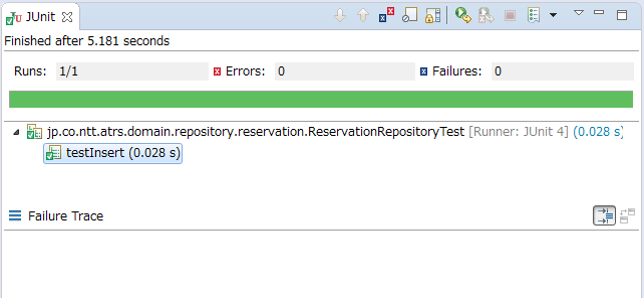
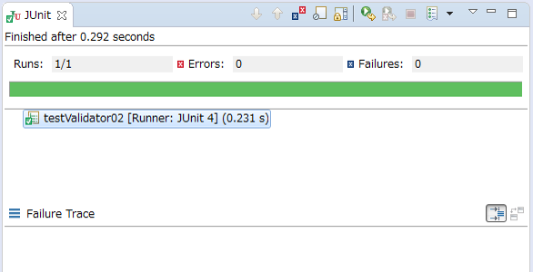

★：要検討

.. _RuningUniteTest:

単体テストの実行
================================================================================

Overview
--------------------------------------------------------------------------------

単体テストの実行方法を以下に示す。

.. tabularcolumns:: |p{0.20\linewidth}|p{0.20\linewidth}|p{0.60\linewidth}|
.. list-table::
    :header-rows: 1
    :widths: 20 40 40

    * - テスト実行方法
      - 説明
      - 使い分けの方針
    * - IDE
      - IDE上からJUnitを実行する。
      - IDE上で単体テストの作成から実行までをまとめて行いたい場合。
    * - maven
      - maven test を使用してJUnitを実行する。
      - コマンドベースでコンソール等から単体テストを実行したい場合。

テストを実行する
--------------------------------------------------------------------------------

本ガイドラインでは、JUnitの実行方法として、

* IDE上でJUnitを実行する方法
* mavenでJUnitを実行する方法

の2種類を用意している。用途に応じていずれかを選択する。

なお、\ **本ガイドラインでは、Spring Tool Suite を用いたJUnitの実行方法を紹介する。** \

使用するIDEによっては画像と異なる画面表示になることを留意されたい。

IDE上でテストを実行
^^^^^^^^^^^^^^^^^^^^^^^^^^^^^^^^^^^^^^^^^^^^^^^^^^^^^^^^^^^^^^^^^^^^^^^^^^^^^^^^

テストクラスの実行
""""""""""""""""""""""""""""""""""""""""""""""""""""""""""""""""""""""""""""""""

テストクラスを右クリックし、メニューを表示させる。

.. figure:: ./images/UnitTestIdeClickTestClass.png

|

メニューから[Run As] -> [JUnit Test]を選択し、対象テストクラスを実行する。

.. figure:: ./images/UnitTestIdeRunClassJunit.png

|

不具合なくテストが実行されれば、以下のような画面が表示される。

|

テストが予定外の結果になった場合（異常系テストで例外が発生しない など）、
以下のようにエラーメッセージが表示される。

.. figure:: ./images/UnitTestIdeFailJunit.png

|

テストを実行する上でエラーが発生した場合（テストで使用するテーブルが作成されていない など）、
以下のようにエラーメッセージが表示される。

|

プロジェクト、メソッド単位で実行
""""""""""""""""""""""""""""""""""""""""""""""""""""""""""""""""""""""""""""""""

JUnitの実行はプロジェクト単位、メソッド単位でも可能である。

プロジェクト単位で実行する場合は、テストしたいプロジェクトを右クリックしてメニューを表示させる。

.. figure:: ./images/UnitTestIdeClickTestProject.png

|

メニューから[Run As] -> [JUnit Test]を選択し、対象プロジェクトのテストを実行する。

.. figure:: ./images/UnitTestIdeRunProjectJunit.png

|

プロジェクト単位で実行した場合は、選択したプロジェクトに含まれる全テストクラスの実行結果が表示される。

|

メソッド単位で実行する場合は、テストしたいメソッドを右クリックしてメニューを表示させる。

|

メニューから[Run As] -> [JUnit Test]を選択し、対象メソッドのテストを実行する。

.. figure:: ./images/UnitTestIdeRunMethodJunit.png

|

メソッド単位で実行した場合は、選択したクラスメソッドの実行結果のみが表示される。

mavenでテストを実行
^^^^^^^^^^^^^^^^^^^^^^^^^^^^^^^^^^^^^^^^^^^^^^^^^^^^^^^^^^^^^^^^^^^^^^^^^^^^^^^^

デフォルトの動作
""""""""""""""""""""""""""""""""""""""""""""""""""""""""""""""""""""""""""""""""

maven で単体テストを実行する場合、以下のコマンドを実行する。

.. code-block:: console

    mvn test

|

コマンドを実行すると、\ ``target/classes``\ 配下にjavaコンパイルした .classファイルを作成したのち、

\ ``target/test-classes``\ 配下にコンパイルしたテスト用 .classファイルを作成し、

\ ``target/surefire-reports``\ 配下にテスト結果が作成される。

デフォルトでは、以下のパターンにマッチするファイルがテストされる。

* \ ``**/Test*.java``\ 
* \ ``**/*Test.java``\ 
* \ ``**/*Tests.java``\ 
* \ ``**/*TestCase.java``\ 

上記パターンにマッチしないテストクラスを実行させたい場合は、

\ ``pom.xml``\ に設定を追加することでデフォルトの動作を変更することができる。

また、除外ファイルの指定も設定することも可能である。

.. code-block:: xml

    <project>

      // ommited

      <build>
        <plugins>
          <plugin>
            <groupId>org.apache.maven.plugins</groupId>
            <artifactId>maven-surefire-plugin</artifactId>
            <version>2.20.1</version>
            <configuration>
              <includes>
                <include>*Sample.java</include> <!-- (1) -->
              </includes>
              <excludes>
                <exclude>TestSample.java</exclude> <!-- (2) -->
              </excludes>
            </configuration>
          </plugin>
        </plugins>
      </build>

      // ommited

    </project>

.. tabularcolumns:: |p{0.10\linewidth}|p{0.90\linewidth}|
.. list-table::
    :header-rows: 1
    :widths: 10 90

    * - 項番
      - 説明
    * - | (1)
      - | \ ``<include>``\ にファイルを指定し、テスト実行時にデフォルトで読み込まれるファイルを変更する。
    * - | (2)
      - | \ ``<exclude>``\ にファイルを指定し、テスト実行時に除外されるファイルを設定する。

.. note::

    対象を指定する際には、正規表現を使って指定することもできる。
    詳細は \ `maven-surefire-plugin (Regular Expression Support) <https://maven.apache.org/surefire/maven-surefire-plugin/examples/inclusion-exclusion.html>`_\ を参照されたい。

任意のクラス、メソッドを実行
""""""""""""""""""""""""""""""""""""""""""""""""""""""""""""""""""""""""""""""""

\ ``maven test``\ コマンドはオプションを用いることで任意のクラス、メソッドを指定し実行することもできる。

テスト対象のクラスを指定する場合は、以下のコマンドを用いて指定できる。

.. code-block:: console

    mvn test -Dtest=[クラス名]

|

「,」 区切りで複数クラスを指定することもできる。

.. code-block:: console

    mvn test -Dtest=[クラス名],[クラス名],[クラス名]...

|

テスト対象のメソッドを指定したい場合は、以下のコマンドを用いて指定できる。

.. code-block:: console

    mvn test -Dtest=[クラス名]#[メソッド名]

|

.. warning::

    メソッド単位の指定は \ ``maven-surefire-plugin``\ のバージョンが2.7.3以上必要となる。
    詳細は \ `maven-surefire-plugin (Running a Set of Methods in a Single Test Class) <http://maven.apache.org/surefire/maven-surefire-plugin/examples/single-test.html>`_\ を参照されたい。

.. note::

    オプションに \ ``-Dmavan.test.skip=true``\ を指定することでテストのコンパイル・実行をスキップすることができる。
    実行のみスキップしたい場合は、\ ``-DskipTests=true``\ を指定することでコンパイルのみ行われるようにすることもできる。
